# Using Mermaid for Entity-Relationship Diagrams

## Introduction to Mermaid ERD

Mermaid is a powerful JavaScript-based diagramming tool that uses text-based syntax to create diagrams, including Entity-Relationship Diagrams (ERDs). Unlike visual drag-and-drop tools, Mermaid allows developers and technical writers to create and maintain database diagrams using simple, readable code that can be version-controlled and integrated directly into documentation.

### Why Choose Mermaid for ERD?

- **Text-Based**: Write diagrams as code, making them easy to edit, version, and collaborate on
- **Version Control Friendly**: Store ERD code in Git repositories alongside your database schemas
- **Documentation Integration**: Embed diagrams directly in markdown files, wikis, and technical documentation
- **AI Compatibility**: Easy for AI tools to generate and modify diagram code
- **Platform Independent**: Runs anywhere JavaScript is supported

## Basic Mermaid ERD Syntax

### Core Structure

All Mermaid ER diagrams begin with the `erDiagram` declaration followed by entity definitions and relationships:

````markdown
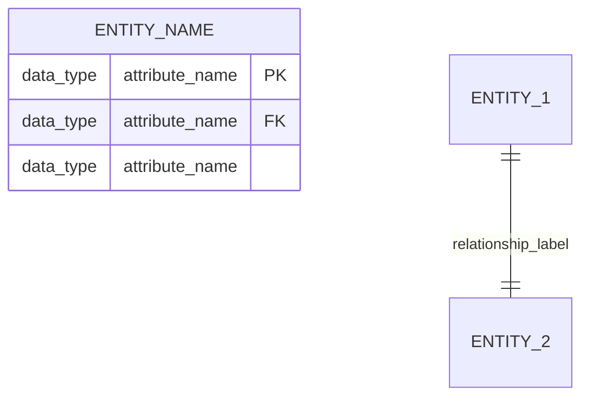
````

### Defining Entities and Attributes

Entities are defined with their attributes listed inside curly braces. Each attribute follows the pattern: `data_type attribute_name constraints`

**Example:**
````markdown
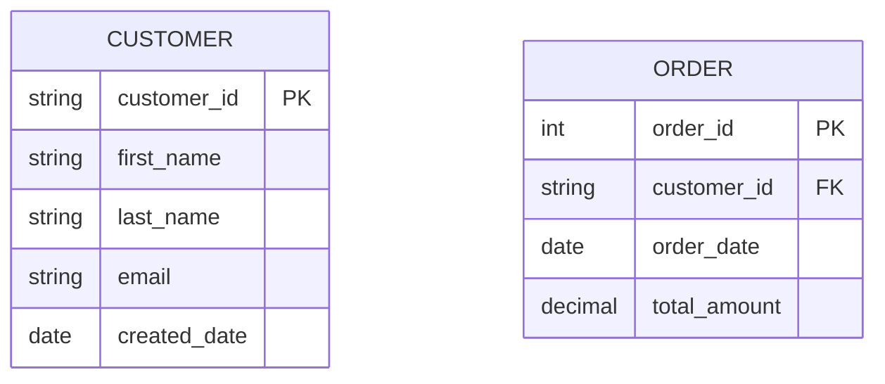
````

### Supported Data Types

Mermaid doesn't enforce specific data types, but common conventions include:
- `string` for text data
- `int` for integers
- `decimal` or `float` for numbers with decimals
- `date`, `datetime` for temporal data
- `boolean` for true/false values

### Primary and Foreign Keys

- `PK` marks an attribute as a primary key
- `FK` marks an attribute as a foreign key
- Composite keys require manual documentation in comments

## Relationship Cardinality Notation

Mermaid uses specific symbols to represent relationship cardinality:

### Cardinality Symbols

| Symbol | Meaning | Description |
|--------|---------|-------------|
| `||--||` | One-to-One | Exactly one to exactly one |
| `||--o{` | One-to-Many | One to zero or more |
| `}o--||` | Many-to-One | Zero or more to one |
| `}o--o{` | Many-to-Many | Zero or more to zero or more |
| `||--|{` | One-to-Many (at least one) | One to one or more |
| `}|--||` | Many-to-One (at least one) | One or more to one |

### Reading Relationship Syntax

The relationship syntax follows this pattern:
```
ENTITY_1 [CARDINALITY_1]--[CARDINALITY_2] ENTITY_2 : "relationship_label"
```

Where:
- **CARDINALITY_1** applies to ENTITY_1
- **CARDINALITY_2** applies to ENTITY_2
- The relationship label describes the nature of the relationship

## Complete ERD Examples

### Simple University Database

````markdown
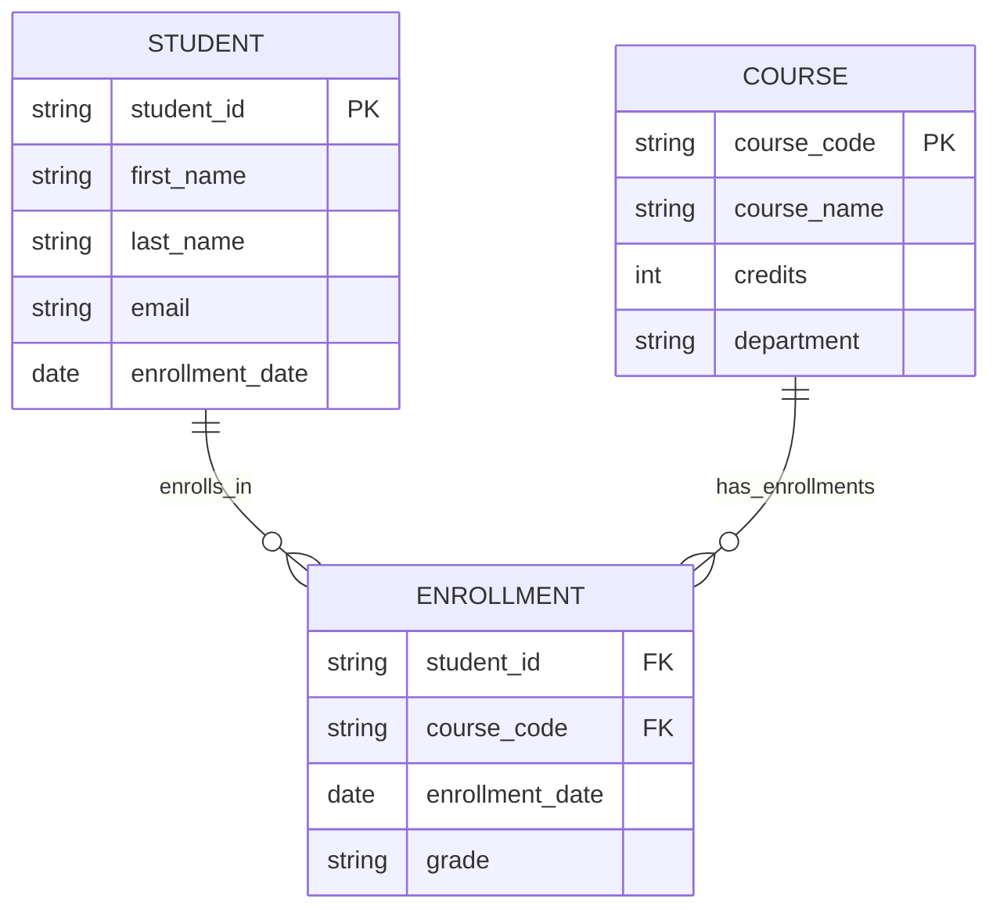
````

### E-Commerce System

````markdown
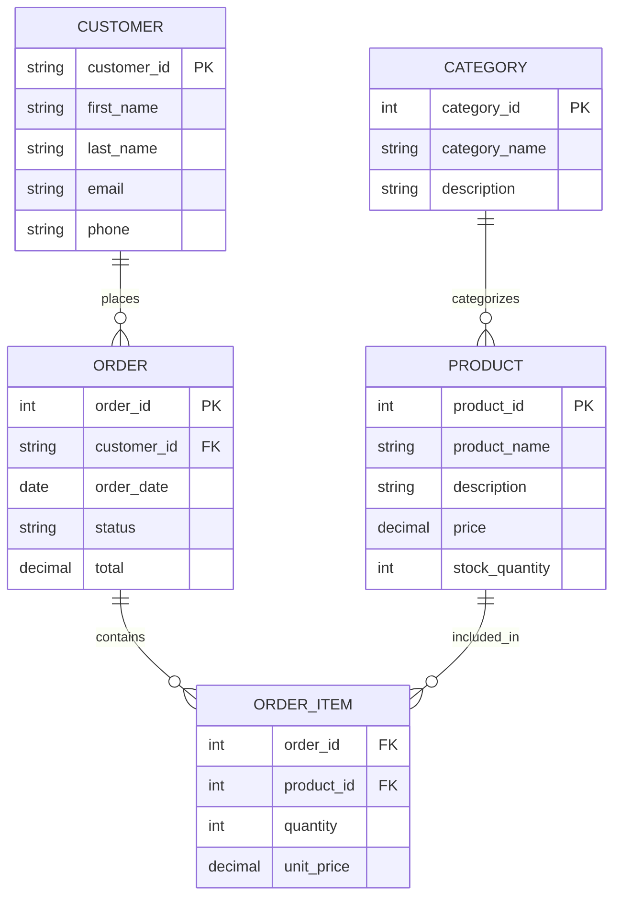
````

## Advanced Mermaid ERD Features

### Weak Entity Representation

While Mermaid doesn't have explicit syntax for weak entities, you can represent them using comments and relationship labels:

````markdown
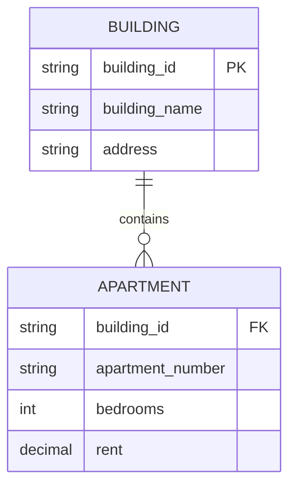
````

### Recursive Relationships

Represent self-referencing relationships using the same entity on both sides:

````markdown
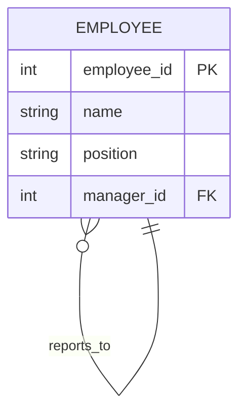
````

### Subtype/Supertype Relationships

Model inheritance relationships using one-to-one relationships:

````markdown
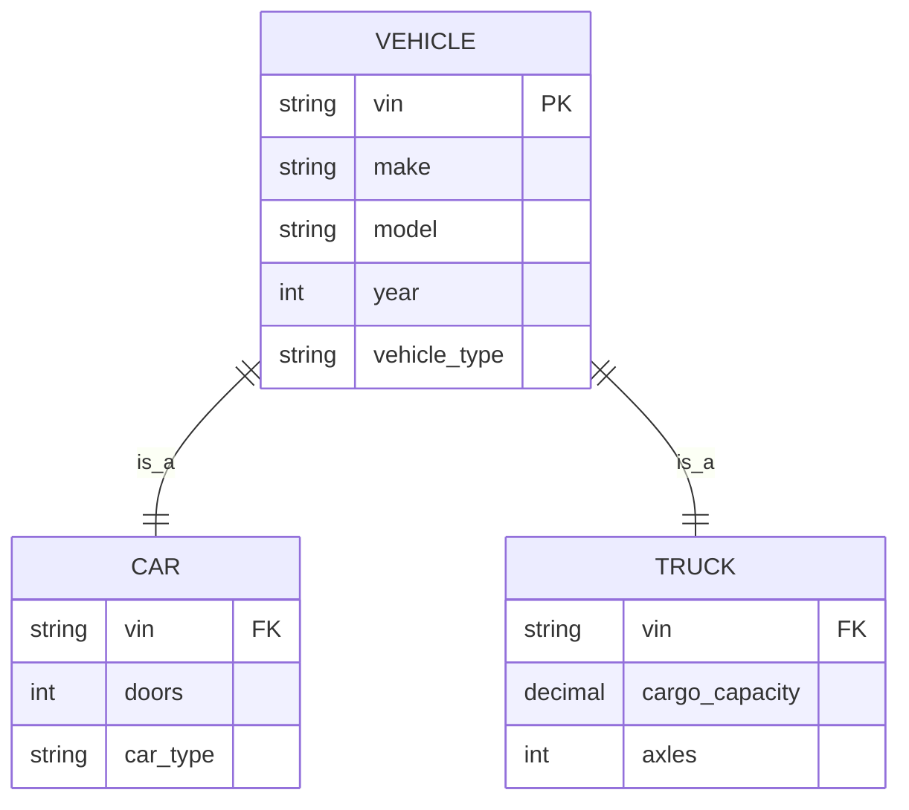
````

## Styling and Configuration

### Basic Styling

Mermaid supports limited styling options through configuration:

````markdown
```mermaid
erDiagram
    CUSTOMER {
        string customer_id PK
        string name
        string email
    }
    
    ORDER {
        int order_id PK
        string customer_id FK
        date order_date
    }
    
    CUSTOMER ||--o{ ORDER : places
    
    %% Styling (if supported by your renderer)
    CUSTOMER {
        background-color: #e1f5fe
    }
    
    ORDER {
        background-color: #f3e5f5
    }
```
````

### Themes

Mermaid supports different themes that can be set in the configuration:
- `default`
- `forest`
- `dark`
- `neutral`

## Integration with Documentation

### GitHub/GitLab Markdown

Mermaid is natively supported in GitHub and GitLab markdown files:

````markdown
# Database Schema Documentation

## Entity-Relationship Diagram

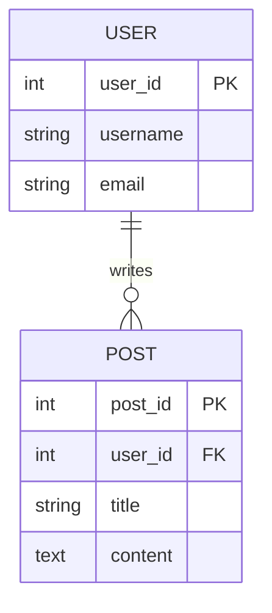

## Table Descriptions

- **USERS**: Stores user account information
- **POSTS**: User-generated content
````

### VS Code Integration

Install the Mermaid extension for VS Code to preview diagrams in real-time:

1. Install "Mermaid Preview" extension
2. Create a `.md` file with Mermaid code blocks
3. Use the preview pane to see rendered diagrams

## Best Practices for Mermaid ERD

### Code Organization

1. **Group Related Entities**: Keep entities that have relationships close together in the code
2. **Consistent Naming**: Use consistent naming conventions for entities and attributes
3. **Descriptive Labels**: Use meaningful relationship labels
4. **Comments**: Add comments to explain complex relationships or constraints

### Readability Tips

- Use line breaks between entity groups
- Order entities logically (parents before children)
- Keep diagrams focused - break large schemas into multiple diagrams
- Use consistent indentation

### Example of Well-Organized ERD

````markdown
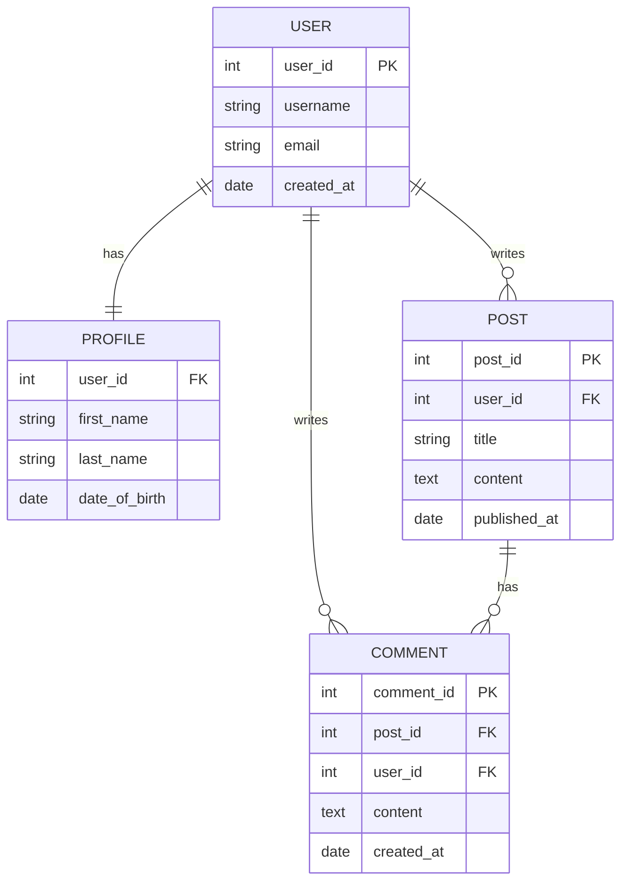
````

## Common Patterns and Solutions

### Many-to-Many Relationships

Always use junction tables for many-to-many relationships:

````markdown
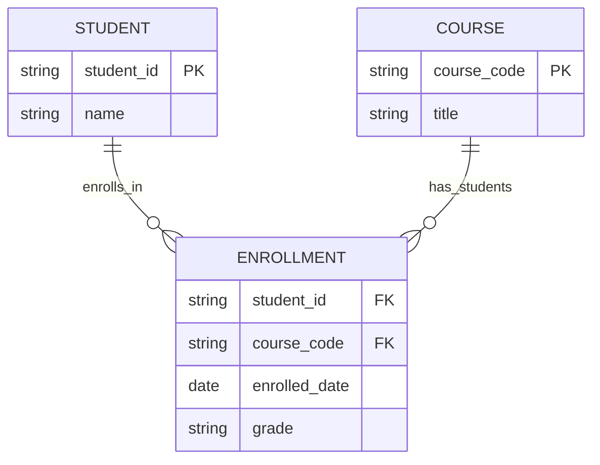
````

### Self-Referencing Relationships

For hierarchical data:

````markdown
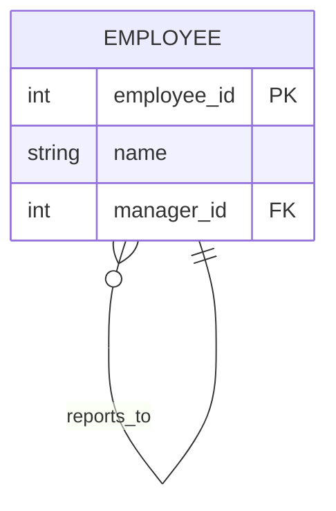
````

## Tools and Workflow

### Development Workflow

1. **Design**: Create initial ERD in Mermaid syntax
2. **Version Control**: Commit to Git repository
3. **Document**: Integrate with markdown documentation
4. **Collaborate**: Use code review processes for changes
5. **Maintain**: Update as database schema evolves

### Supported Platforms

- **GitHub/GitLab**: Native Mermaid support in markdown
- **VS Code**: With Mermaid preview extension
- **Obsidian**: Native support in notes
- **Notion**: Limited support
- **Documentation Generators**: MkDocs, Docusaurus, etc.

## Troubleshooting Common Issues

### Syntax Errors

- **Missing Braces**: Ensure all entities have opening and closing braces
- **Relationship Format**: Verify cardinality symbols are correct
- **Attribute Format**: Use proper `type name constraint` format

### Rendering Issues

- **Platform Support**: Confirm your platform supports Mermaid
- **Version Compatibility**: Some features may require specific Mermaid versions
- **Theme Conflicts**: Check if custom themes affect rendering

## Conclusion

Mermaid provides a powerful, text-based approach to creating Entity-Relationship Diagrams that integrates seamlessly with modern development workflows. By treating diagrams as code, teams can version control their database designs, collaborate effectively, and maintain accurate documentation that evolves with their systems.

The simplicity of Mermaid's syntax makes it accessible for developers while providing enough expressiveness to model complex database relationships. When combined with version control and modern documentation practices, Mermaid ERDs become a living part of your system documentation rather than static artifacts that quickly become outdated.